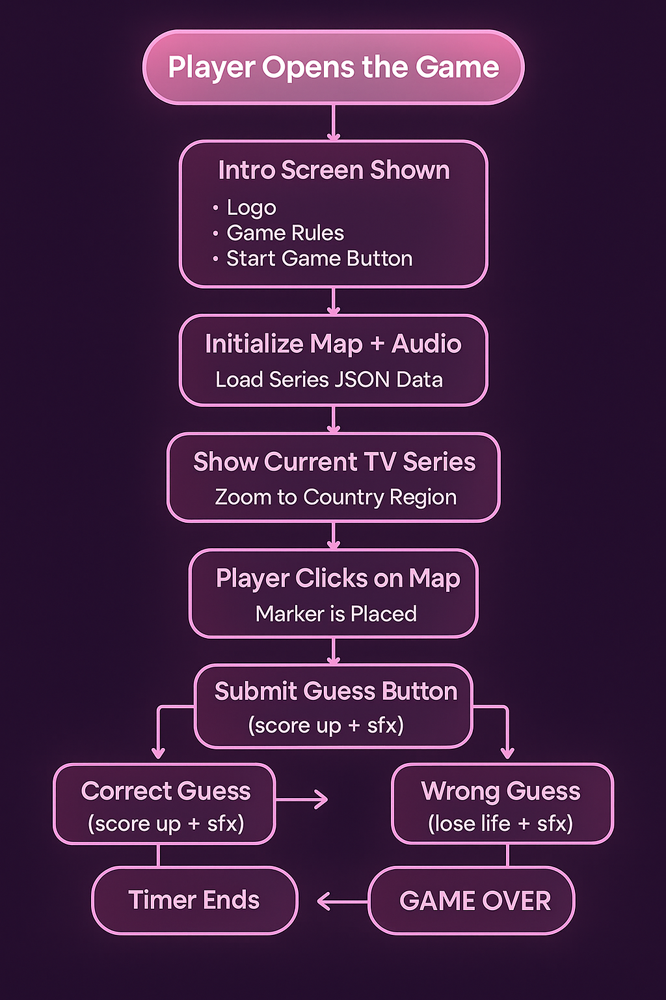
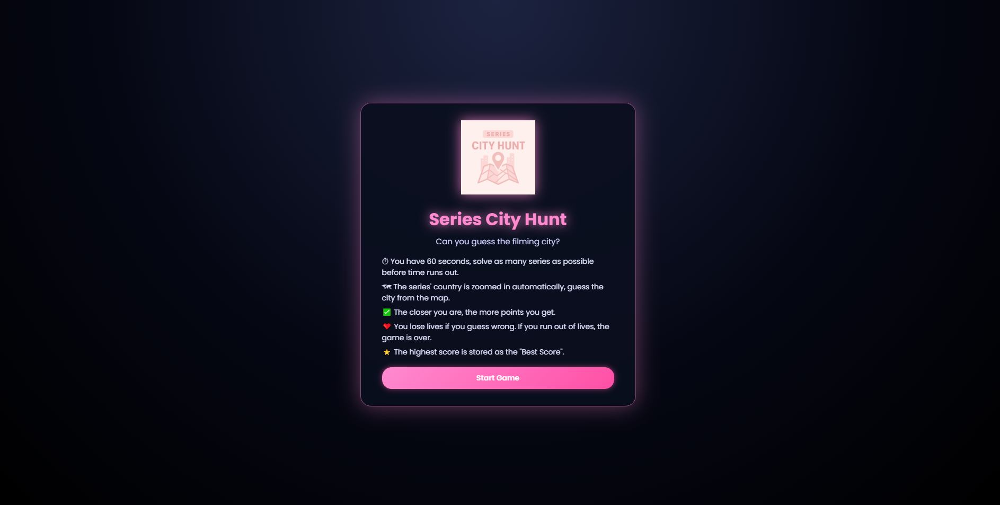
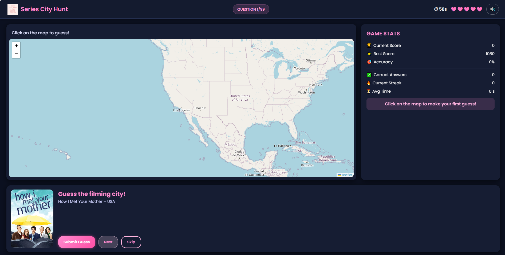
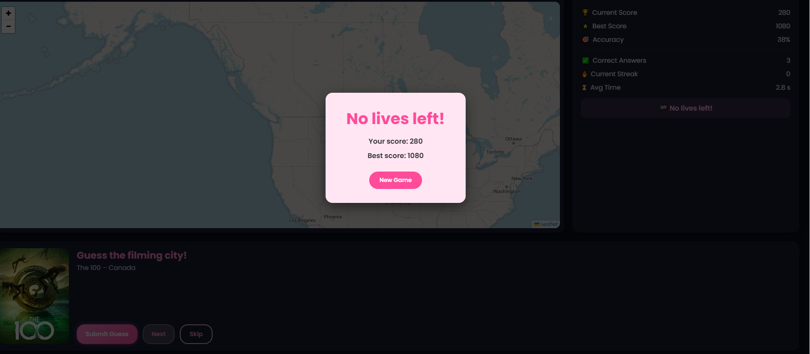
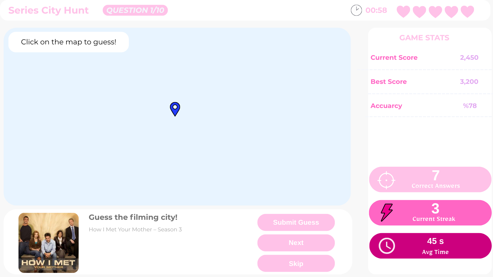

# 🎯 Series City Hunt

Series City Hunt is a fast-paced, map-based quiz game where you guess the **filming city** of popular TV series by clicking on an interactive world map (Leaflet). You race against a countdown timer, manage your lives, and try to beat your **Best Score** in one intense round.

---

## 🔗 Live Demo 

- **Play the game:**  
  👉 https://gmt-458-web-gis.github.io/geogame-zecereve/  

---

## 🕹️ Game Overview

**Core idea**

- You see a TV series poster and title at the bottom of the screen.
- The map automatically zooms to the **country** where the series is filmed.
- You click on the map to guess the **city**.
- Your distance to the correct city determines the feedback and your score.
- You have **60 seconds** and a limited number of **lives** to answer as many series as possible.

**Key mechanics**

- ⏱ **Timer:** 60-second countdown per game.
- ❤️ **Lives:** You lose a life when your guess is far from the real city.
- ⭐ **Scoring:** Closer guesses earn more points; long distances can cost you lives.
- 💾 **Best Score:** Persisted in `localStorage` and shown in the stats panel.
- 🔊 **Audio:** Background music + sound effects for clicks / correct / wrong (can be muted).

---

## 🧩 How to Play

1. **Open the game** in your browser or via GitHub Pages.
2. You first see an **Intro Screen**:
   - Game logo
   - Short rules
   - **Start Game** button
3. Click **Start Game**:
   - Map + audio are initialized
   - Series data (`data/series.json`) is loaded
   - The first TV series is shown
4. **Click on the map** to place a marker where you think the filming city is.
5. Press **Submit Guess**:
   - The game computes your distance using the **Haversine** formula.
   - Feedback + points / life updates are displayed in the **Game Stats** panel.
6. Use **Next** to move to the next series, or **Skip** to skip without scoring.
7. The game ends when:
   - The **timer reaches 0**, or  
   - Your **lives reach 0**, or  
   - You run out of series.
8. A **Game Over** modal appears:
   - Shows final score, best score
   - Offers a **New Game** button (restarts game without showing intro again).

---

## 📊 Scoring & Lives

| Distance to Target      | Feedback Text            | Points | Life Lost? |
|-------------------------|--------------------------|--------|-----------|
| `0 – 50 km`             | **Perfect guess!**       | 150    | No        |
| `51 – 150 km`           | **Very close!**          | 120    | No        |
| `151 – 400 km`          | **Close guess!**         | 80     | No        |
| `401 – 1500 km`         | **Far, but not too bad.**| 0      | ✅ Yes     |
| `> 1500 km`             | **Way too far.**         | 0      | ✅ Yes     |

Additional rules:

- Every **correct streak of 3** answers grants a small **bonus**.
- **Best Score** is updated only when the current score exceeds the saved value.

---

## 🧠 Game Flow

The overall flow of the game is:

1. Player opens the game.
2. **Intro screen** is shown (logo, rules, Start Game button).
3. Player clicks **Start Game**.
4. Map + audio initialized, series JSON loaded.
5. Current series appears, map zooms to the corresponding country.
6. Player clicks on the map, places a marker.
7. Player submits guess → correct or wrong:
   - Correct ⇒ score up + SFX, go to next question.
   - Wrong ⇒ lose life + SFX, go to next question.
8. Timer or lives run out ⇒ **Game Over** modal.
9. Player may start **New Game**.

### Visual Flowchart

---

## 🖼️ UI Screens

### Intro Screen

This is the **first screen**, shown before the timer starts. It includes the logo, rules, and the Start Game button.

---

### Main Gameplay Screen

The dark-mode map layout used during the game. It contains:

- Top bar: logo, question counter, timer, lives, mute button  
- Left: Leaflet map  
- Right: **Game Stats** panel  
- Bottom: series poster + guess controls

---

### Game Over Screen

Shown when time or lives run out. Displays summary stats and a **New Game** button.

---

### Original Layout Sketch

Early Canva design used during the planning phase.

---

## 🛠️ Tech Stack

| Layer       | Technology                    |
|------------|--------------------------------|
| Markup     | HTML5                         |
| Styling    | CSS3 (custom, dark/pink theme)|
| Logic      | Vanilla JavaScript (ES6)      |
| Mapping    | Leaflet.js                    |
| Data       | `data/series.json` (custom)   |
| Hosting    | GitHub Pages                  |

---

## 📁 Project Structure (simplified)

![geogame-zecereve/
│ README.md
│
├─ docs/
│   ├─ sketches/
│   │   ├─ end.png
│   │   ├─ flowchart.png
│   │   ├─ intro.png
│   │   ├─ layout.png
│   │   └─ screen.png
│   ├─ analysis-report.md
│   ├─ design.md
│   └─ requirements.md
│
└─ src/
    ├─ audio/
    │   ├─ bg-music.mp3
    │   ├─ click.mp3
    │   ├─ correct.mp3
    │   └─ wrong.mp3
    ├─ css/
    │   └─ style.css
    ├─ data/
    │   ├─ series.json
    ├─ img/
    │   ├─ logo.png
    │   └─ series/
    │       ├─ *.jpg (100 poster)
    ├─ js/
    │   ├─ main.js (tek dosya oldu artık)
    │   
    └─ index.html

